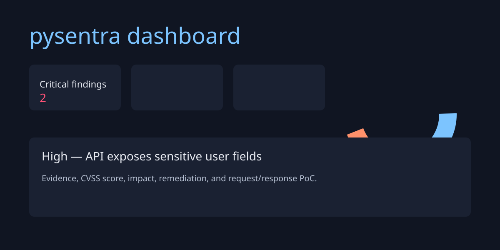

# pysentra

[](https://pypi.org/project/pysentra/) [](https://pypi.org/project/pysentra/) [](LICENSE) [](https://github.com/Sanjiv215/PySentra/actions/workflows/test.yml)

Local-first web application security scanning for authorized assessments, with a live vulnerability dashboard.

> **Authorization required** — Use pysentra only against systems you own or have explicit written permission to test. It rate-limits requests, avoids destructive checks, and requires an authorization confirmation before scanning. The bundled demo application is intentionally vulnerable and must never be deployed as a real service.

This project was initially prototyped for Smart India Hackathon problem statement 26163 (NTRO) and has been hardened into a production-grade security auditing tool.

## Privacy

pysentra makes no external network calls other than to the target you specify. No telemetry, no analytics, no data leaves your machine. All scan reports, logs, and artifacts are stored locally in the `pysentra-reports/` directory.

## Install

```sh
pip install pysentra
```

For local development, use `pip install -e ".[dev]"`.

## Quickstart

Run the intentionally vulnerable demo target in one terminal:

```sh
cd demo-vulnerable-app
pip install -r requirements.txt
python app.py
```

Then scan it from the project root:

```sh
pysentra scan http://localhost:5000 --i-am-authorized --target-is-test-app
```

The scanner writes `report.json` and a printable `report.html` under `pysentra-reports/<timestamp>/`, starts a dashboard securely bound to `127.0.0.1:8765`, and opens it unless `--no-open` is used.

## Dashboard



The dashboard has severity cards, a findings chart when Chart.js is available, filters, expandable evidence, and JSON/HTML export links.

## CLI Reference

| Flag | Purpose |
| --- | --- |
| `pysentra scan <url>` | Scan an HTTP(S) target. URL must be a valid `http://` or `https://` URL. |
| `--i-am-authorized` | Confirm authorization non-interactively. |
| `--target-is-test-app` | Enable extra safe checks only intended for the bundled test app. |
| `--modules auth,authz,input,api,client,tls,storage` | Run a selected comma-separated module set. |
| `--auth-token <token>` | First test token for read-only authorization checks. |
| `--second-auth-token <token>` | Second test token; enables cross-user IDOR checks. |
| `--rate-limit <n>` | Maximum requests per second (positive number); default `5`. |
| `--bind <host>` | Host address to bind the dashboard server; default `127.0.0.1`. |
| `--port <port>` | Dashboard server port (integer 1-65535); default `8765`. |
| `--headless-browser` | Request optional Playwright-based browser checks. |
| `--no-open` | Do not automatically open the dashboard. |

## Architecture

The scanner orchestrates seven scope-area modules and sends every request through a rate-limited, audited request wrapper:

1. Authentication & Session Management (`auth_checks`)
2. Authorization & Access Control (`authz_checks`)
3. Input Validation & Data Handling (`input_checks`)
4. API Security (`api_checks`)
5. Client-Side Security Controls (`client_side_checks`)
6. Secure Communication Mechanisms (`tls_checks`)
7. Data Storage & Privacy Protections (`storage_privacy_checks`)

Findings include a CVSS 3.1 base score, evidence, reproduction request, impact, and remediation. The audit log is embedded in both report formats.

## Contributing

See [CONTRIBUTING.md](CONTRIBUTING.md). Do not add checks that could be destructive, credential-brute-force targets, or bypass the authorization and rate-limit safeguards.
